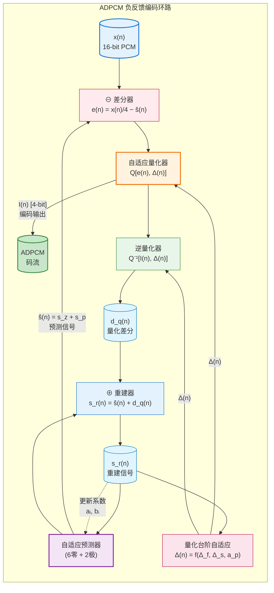
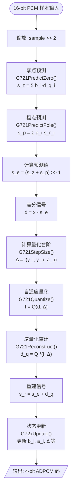
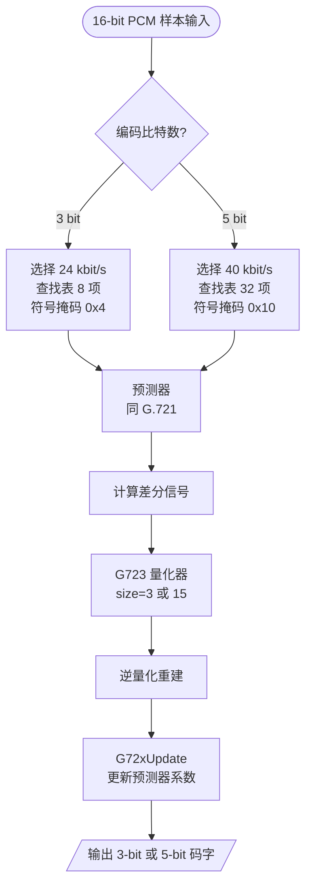
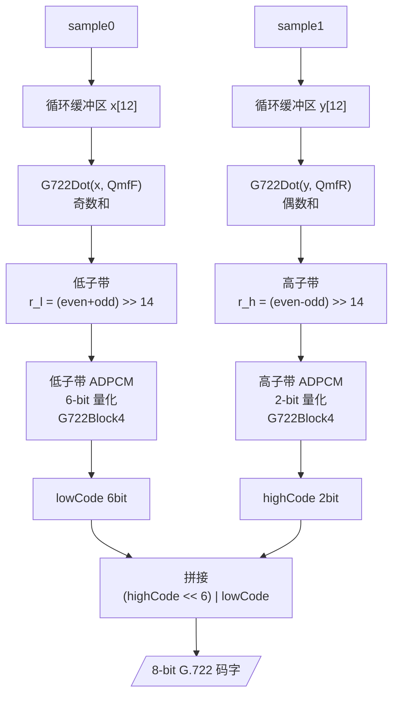
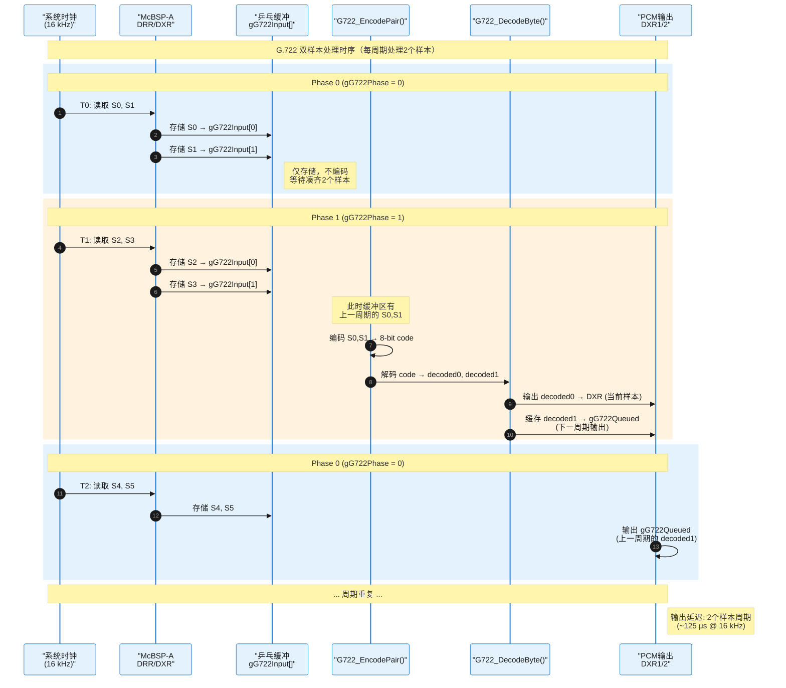
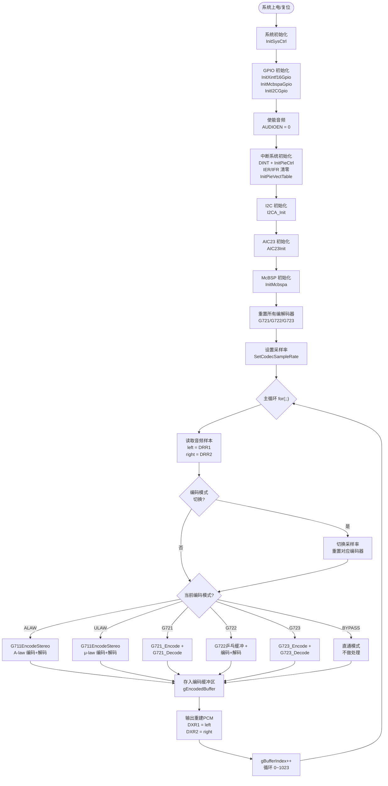
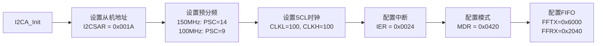
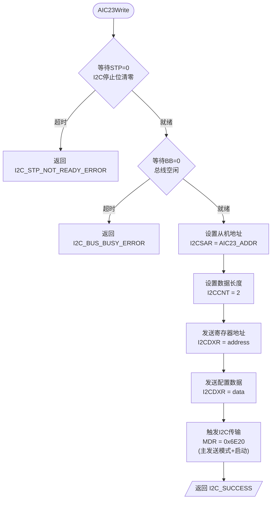

# DSP 音频编解码算法实现文档

> **课程**：DSP 原理及应用 —— 课程设计大作业  
> **题目**：音频信号的编码和解码  
> **平台**：TMS320F28335 DSP + TLV320AIC23 音频编解码器  
> **工具**：CCS (Code Composer Studio)  
> **编程语言**：C

---

## 目录

1. [系统概述](#1-系统概述)
2. [硬件平台架构](#2-硬件平台架构)
3. [G.711 A-law / μ-law 算法](#3-g711-a-law--μ-law-算法)
4. [G.721 32 kbit/s ADPCM 算法](#4-g721-32-kbits-adpcm-算法)
5. [G.723 ADPCM 算法](#5-g723-adpcm-算法)
6. [G.722 64 kbit/s 宽带 ADPCM 算法](#6-g722-64-kbits-宽带-adpcm-算法)
7. [主程序流程](#7-主程序流程)
8. [外设驱动模块](#8-外设驱动模块)
9. [状态结构与查找表](#9-状态结构与查找表)
10. [附录：完整技术参数对照表](#10-附录完整技术参数对照表)

---

## 1. 系统概述

### 1.1 项目功能

本系统在 **TMS320F28335** DSP 平台上，通过 **TLV320AIC23** 立体声音频编解码器采集模拟音频信号，实时实现多种 ITU-T 语音编码标准的 **编码→解码** 环路处理，并将解码后的 PCM 数据直接输出，使用户可以实时听到编解码后的音频效果。

### 1.2 支持的编解码模式

| 模式编号 | 宏定义 | 编码标准 | 编码类型 | 比特率 |
|:---:|:---|:---|:---|:---:|
| 0 | `CODEC_MODE_BYPASS` | 直通 | PCM 无压缩 | 16 bit/sample |
| 1 | `CODEC_MODE_ALAW` | **G.711 A-law** | PCM 对数量化 | 64 kbit/s |
| 2 | `CODEC_MODE_ULAW` | **G.711 μ-law** | PCM 对数量化 | 64 kbit/s |
| 3 | `CODEC_MODE_G721` | **G.721** | ADPCM | 32 kbit/s |
| 4 | `CODEC_MODE_G722` | **G.722** | 子带 ADPCM（宽带） | 64 kbit/s |
| 5 | `CODEC_MODE_G723_24` | **G.723** | ADPCM | 24 kbit/s |
| 6 | `CODEC_MODE_G723_40` | **G.723** | ADPCM | 40 kbit/s |

### 1.3 系统顶层数据流图


> 音频信号经 LINE IN 输入 → McBSP 接收 → 编码器压缩 → 解码器重建 → McBSP 发送 → LINE OUT 输出。TLV320AIC23 通过 I2C 配置，采样率可在 8 kHz（窄带）与 16 kHz（G.722 宽带）之间切换。

---

## 2. 硬件平台架构

### 2.1 TMS320F28335 资源使用

| 外设 | 用途 |
|:---|:---|
| **McBSP-A** | 与 AIC23 之间的双向音频数据传输（I2S 格式） |
| **I2C** | 配置 AIC23 内部寄存器（采样率、音量、数据格式等） |
| **XINTF** | 外部接口，控制 AIC23 的音频使能引脚 |

### 2.2 TLV320AIC23 配置

AIC23 是一款低功耗立体声音频编解码器，通过 I2C 总线配置其内部 11 个寄存器：

| 寄存器地址 | 功能 | 配置值 |
|:---:|:---|:---|
| 0x00 | 左声道输入音量 | 0x00（静音） |
| 0x02 | 右声道输入音量 | 0x00（静音） |
| 0x04 | 左声道耳机音量 | 0x7F（最大） |
| 0x06 | 右声道耳机音量 | 0x7F（最大） |
| 0x08 | 模拟音频路径控制 | 0x14（DAC 选择，麦克风静音） |
| 0x0A | 数字音频路径控制 | 0x00 |
| 0x0C | 电源控制 | 0x00（全部开启） |
| 0x0E | 数字音频接口格式 | 0x43（I2S，16 bit，主模式） |
| 0x10 | 采样率控制 | 0x23（8 kHz）/ 0x4D（16 kHz，G.722） |
| 0x12 | 激活控制 | 0x01（激活） |

---

## 3. G.711 A-law / μ-law 算法

### 3.1 算法原理

G.711 是 ITU-T 定义的最基本的语音编码标准，采用 **PCM（脉冲编码调制）** 加 **对数压缩** 技术。核心思想是利用人耳对小声敏感、大声不敏感的心理声学特性，对小幅值信号采用细量化、大幅值信号采用粗量化，从而用 8 bit 表示原本 13~14 bit 的动态范围。

#### 3.1.1 心理声学基础

人耳对声音强度的感知近似**对数关系**（韦伯-费希纳定律）。在小信号时，量化误差需要很小才能不被察觉；在大信号时，较大的量化误差也能被接受。因此采用**对数压缩曲线**来分配量化台阶。

### 3.2 A-law 压缩算法

#### 3.2.1 数学公式

A-law 压缩特性曲线（CCITT G.711 标准）定义为：

$$F(x) =
\begin{cases}
\frac{A|x|}{1+\ln A}\cdot \text{sgn}(x), & 0 \leq |x| < \frac{1}{A} \\[8pt]
\frac{1+\ln(A|x|)}{1+\ln A}\cdot \text{sgn}(x), & \frac{1}{A} \leq |x| \leq 1
\end{cases}$$

其中 $A = 87.6$（实际取 $A = 87.6$，量化折线近似时取 $A \approx 87.56$）。

#### 3.2.2 13 段折线近似

实际 DSP 实现采用 **13 段折线** 近似对数曲线，将量化范围划分为 8 个正负对称的段落：

| 段落编号 | 输入范围（归一化） | 步长比例 | 量化台阶数 |
|:---:|:---|:---|:---:|
| 0 | 0 ~ 1/128 | 2 | 16 |
| 1 | 1/128 ~ 1/64 | 2 | 16 |
| 2 | 1/64 ~ 1/32 | 4 | 16 |
| 3 | 1/32 ~ 1/16 | 8 | 16 |
| 4 | 1/16 ~ 1/8 | 16 | 16 |
| 5 | 1/8 ~ 1/4 | 32 | 16 |
| 6 | 1/4 ~ 1/2 | 64 | 16 |
| 7 | 1/2 ~ 1 | 128 | 16 |

#### 3.2.3 编码格式

A-law 编码 8 bit 格式：


- **S (bit 7)**：符号位，0=正，1=负
- **M[2:0] (bit 6:4)**：段落编号（0~7），采用**折叠二进制码**（异或 0x55 后）
- **Q[3:0] (bit 3:0)**：段内量化台阶，均匀分配 16 个层次

> **注**：A-law 规定偶数位取反，编码时用掩码 `0xD5`（正）或 `0x55`（负）进行异或。

### 3.3 μ-law 压缩算法

#### 3.3.1 数学公式

μ-law 压缩特性（北美/日本标准，$\mu = 255$）：

$$F(x) = \frac{\ln(1 + \mu|x|)}{\ln(1 + \mu)} \cdot \text{sgn}(x), \quad -1 \leq x \leq 1$$

#### 3.3.2 15 段折线近似

μ-law 采用 **15 段折线** 近似，$\mu = 255$，8 个正段 + 8 个负段（中间段合并为正负共用）。与 A-law 相比，μ-law 在大信号段量化噪声更大，但在小信号段提供更好的保真度。

| 段落编号 | 输入范围 | 步长因子 |
|:---:|:---|:---:|
| 0 | 0 ~ 1/255 | ≥ 1 |
| 1 | 1/255 ~ 3/255 | 2 |
| 2 | 3/255 ~ 7/255 | 4 |
| 3 | 7/255 ~ 15/255 | 8 |
| 4 | 15/255 ~ 31/255 | 16 |
| 5 | 31/255 ~ 63/255 | 32 |
| 6 | 63/255 ~ 127/255 | 64 |
| 7 | 127/255 ~ 1 | 128 |

#### 3.3.3 编码格式

μ-law 编码 8 bit 格式（全位取反，掩码 `0xFF` 或 `0x7F` 异或）：

```
┌───┬───┬───┬───┬───┬───┬───┬───┐
│ S │ M2│ M1│ M0│ Q3│ Q2│ Q1│ Q0│
└───┴───┴───┴───┴───┴───┴───┴───┘
  全部位取反后再异或掩码
```

#### 3.3.4 偏置处理

μ-law 在编码时加入 **偏置 `0x84` (132)**，使零附近的小信号在量化时不会落入死区：

$$\text{magnitude} = |x| + 132$$

### 3.4 A-law 编码器核心代码解析

```c
// 文件位置: main_code.c : 378-422
static unsigned char LinearToALaw(int pcm)
{
    static const unsigned long segmentEnd[8] =
    {
        0x001FUL, 0x003FUL, 0x007FUL, 0x00FFUL,
        0x01FFUL, 0x03FFUL, 0x07FFUL, 0x0FFFUL
    };
    long sample;
    unsigned long magnitude;
    Uint16 mask;
    Uint16 segment;
    Uint16 code;

    sample = (long)pcm;
    sample >>= 3;      // 14-bit → 11-bit (保留符号，减少精度换取标准格式)

    if (sample >= 0L)
    {
        mask = 0x00D5U;                    // 正数掩码: 偶数位取反
        magnitude = (unsigned long)sample;
    }
    else
    {
        mask = 0x0055U;                    // 负数掩码
        magnitude = (unsigned long)(-sample - 1L);
    }

    segment = FindSegment(magnitude, segmentEnd, 8U);  // 查找段落编号
    if (segment >= 8U)
    {
        return (unsigned char)(0x007FU ^ mask);  // 溢出时返回最大值
    }

    code = (Uint16)(segment << 4);   // 段落号占高3位(bits 6:4)
    if (segment < 2U)
    {
        code |= (Uint16)((magnitude >> 1) & 0x000FUL);  // 段落0,1: 除以2
    }
    else
    {
        code |= (Uint16)((magnitude >> segment) & 0x000FUL); // 段落2-7: 除以2^segment
    }

    return (unsigned char)((code ^ mask) & 0x00FFU);  // 异或掩码，偶数位取反
}
```

### 3.5 A-law 解码器核心代码解析

```c
// 文件位置: main_code.c : 424-449
static int ALawToLinear(unsigned char inputCode)
{
    Uint16 code;
    Uint16 segment;
    long sample;

    code = ((Uint16)inputCode & 0x00FFU) ^ 0x0055U;  // 解除偶数位取反
    sample = (long)((code & 0x000FU) << 4);          // 提取尾数并左移4位
    segment = (code & 0x0070U) >> 4;                  // 提取段落号(bit 6:4)

    if (segment == 0U)
        sample += 8L;           // 段落0: 加0.5量化台阶
    else if (segment == 1U)
        sample += 0x108L;       // 段落1: 加段落起始值+0.5台阶
    else
    {
        sample += 0x108L;       // 段落2-7: 加偏移后按段左移
        sample <<= (segment - 1U);
    }

    return (code & 0x0080U) ? (int)sample : (int)(-sample);  // 恢复符号
}
```

### 3.6 μ-law 编码器核心代码解析

```c
// 文件位置: main_code.c : 451-487
static unsigned char LinearToULaw(int pcm)
{
    static const unsigned long segmentEnd[8] =
    {
        0x00FFUL, 0x01FFUL, 0x03FFUL, 0x07FFUL,
        0x0FFFUL, 0x1FFFUL, 0x3FFFUL, 0x7FFFUL
    };
    long sample;
    unsigned long magnitude;
    Uint16 mask;
    Uint16 segment;
    Uint16 code;

    sample = (long)pcm;

    if (sample < 0L)
    {
        magnitude = (unsigned long)(-sample);
        mask = 0x007FU;          // 负数掩码
    }
    else
    {
        magnitude = (unsigned long)sample;
        mask = 0x00FFU;          // 正数掩码
    }

    if (magnitude > ULAW_CLIP)    // 限幅保护 (32635)
        magnitude = ULAW_CLIP;
    magnitude += ULAW_BIAS;       // 加偏置 132

    segment = FindSegment(magnitude, segmentEnd, 8U);
    code = (Uint16)((segment << 4) |
                    ((magnitude >> (segment + 3U)) & 0x000FUL));

    return (unsigned char)((code ^ mask) & 0x00FFU);
}
```

### 3.7 μ-law 解码器核心代码解析

```c
// 文件位置: main_code.c : 489-503
static int ULawToLinear(unsigned char inputCode)
{
    Uint16 code;
    long sample;

    code = (~(Uint16)inputCode) & 0x00FFU;     // 全部位取反
    sample = (long)(((code & 0x000FU) << 3) + ULAW_BIAS); // 尾数×8 + 132
    sample <<= ((code & 0x0070U) >> 4);         // 按段落号左移

    if (code & 0x0080U)
        return (int)(ULAW_BIAS - sample);       // 负数
    return (int)(sample - ULAW_BIAS);           // 正数
}
```

### 3.8 A-law / μ-law 编码流程对比图


| 特性对比 | A-law | μ-law |
|:---|:---|:---|
| 标准地区 | 欧洲 / 中国 | 北美 / 日本 |
| 压缩参数 | $A = 87.6$ | $\mu = 255$ |
| 折线段数 | 13 段 | 15 段 |
| 小信号噪声 | 稍大 | 更小 |
| 大信号噪声 | 更小 | 稍大 |
| 偏置 | 无 | `ULAW_BIAS = 132` |
| 限幅值 | PCM 范围限制 | `ULAW_CLIP = 32635` |

---

## 4. G.721 32 kbit/s ADPCM 算法

### 4.1 算法原理

G.721 是 ITU-T 定义的 **自适应差分脉冲编码调制（ADPCM）** 标准，将 64 kbit/s 的 A-law/μ-law PCM 码流转换为 32 kbit/s 的 ADPCM 码流（4 bit/sample），实现 2:1 压缩比。

#### 4.1.1 ADPCM 核心思想

ADPCM 不直接对输入样本编码，而是：

1. **预测**：利用过去的重构信号预测当前样本值
2. **差分**：计算预测值与实际值的差值
3. **自适应量化**：根据信号统计特性动态调整量化台阶
4. **编码传输**：仅传输量化后的差值索引（4 bit）

$$\text{ADPCM码字} = Q\left(e(n)\right), \quad e(n) = x(n) - \hat{x}(n)$$

其中 $Q(\cdot)$ 为自适应量化器，$\hat{x}(n)$ 为预测器输出。

#### 4.1.2 G.721 编码器框图



### 4.2 算法核心公式

#### 4.2.1 预测器

G.721 采用 **二阶极点 + 六阶零点** 的混合预测器：

**零点预测器（6 阶 FIR）**：
$$s_z(n) = \sum_{i=0}^{5} b_i(n-1) \cdot d_q(n-i)$$

**极点预测器（2 阶 IIR）**：
$$s_p(n) = \sum_{i=0}^{1} a_i(n-1) \cdot s_r(n-i-1)$$

**综合预测值**：
$$\hat{x}(n) = s_z(n) + s_p(n)$$

其中 $d_q(n-i)$ 为过去的量化差分信号，$s_r(n-i-1)$ 为过去的重构信号。

#### 4.2.2 自适应量化器

量化台阶 $\Delta(n)$ 由快慢两路自适应因子组成：

**快速因子**（追踪瞬态变化）：
$$\Delta_f(n) = \left(1 - \frac{1}{32}\right)\Delta_f(n-1) + \frac{1}{32} \cdot W[I(n)]$$

**慢速因子**（追踪稳态变化）：
$$\Delta_s(n) = \left(1 - \frac{1}{128}\right)\Delta_s(n-1) + \frac{1}{128} \cdot W[I(n)]$$

**综合台阶**（自适应组合）：
$$\Delta(n) = \Delta_f(n) \quad \text{（快速模式）或组合模式}$$

**对数域量化**：
$$I(n) = \arg\min_k \left| DLN(k) + \frac{\Delta(n)}{4} - \log_2|e(n)| \right|$$

其中 $DLN(k)$ 为量化器判决电平表。

#### 4.2.3 系数自适应更新

**极点系数 a₁** 的更新：
$$a_1(n) = a_1(n-1) - \frac{a_1(n-1)}{128} + f(I, \text{sgn})$$

其中 $f(I, \text{sgn})$ 根据输入信号符号和状态进行调整。

**零点系数 bᵢ** 的更新（Leaky sign algorithm）：
$$b_i(n) = \left(1 - \frac{1}{256}\right)b_i(n-1) \pm 128 \cdot \text{sgn}[d_q(n)] \cdot \text{sgn}[d_q(n-i-1)]$$

### 4.3 浮点数乘法模拟 (`G721Fmult`)

由于 F28335 是定点 DSP，G.721 中的浮点运算通过 **对数域-线性域转换** 实现：

```c
// 文件位置: main_code.c : 528-544
static long G721Fmult(long an, long srn)
{
    long magnitude, exponent, mantissa;
    long resultExponent, resultMantissa, result;

    // 步骤1: 将 an 分解为 指数 + 尾数
    magnitude = (an > 0L) ? an : ((-an) & 0x1FFFL);  // 取绝对值的低13位
    exponent = G721Quan(magnitude, g721Power2, 15) - 6L;  // 求log2指数
    mantissa = (magnitude == 0L) ? 32L :
               ((exponent >= 0L) ?
                (magnitude >> exponent) : (magnitude << -exponent));  // 尾数×32

    // 步骤2: 组合指数和尾数
    resultExponent = exponent + ((srn >> 6) & 15L) - 13L;
    resultMantissa = (mantissa * (srn & 63L)) >> 4;

    // 步骤3: 重组结果
    result = (resultExponent >= 0L) ?
             ((resultMantissa << resultExponent) & 0x7FFFL) :
             (resultMantissa >> -resultExponent);

    return ((an ^ srn) < 0L) ? -result : result;  // 恢复符号
}
```

**算法原理**（对数乘法 → 转换为加法）：

在 G.721 的浮点表示中，每个数表示为：
$$x = \pm 2^{e-6} \cdot \frac{m}{32}$$

其中 $e$ 为指数，$m$ 为尾数（定点化的 32 倍）。

两个数相乘：
$$x \cdot y = 2^{(e_x+e_y)-13} \cdot \frac{m_x \cdot m_y}{32}$$
$$= 2^{E} \cdot M$$

其中 $E = e_x + e_y - 13$，$M = (m_x \cdot m_y) \gg 4$。

### 4.4 G.721 编码流程



### 4.5 G.721 编码器代码

```c
// 文件位置: main_code.c : 762-782
static unsigned int G721_Encode(int sample, G721State *state)
{
    long zeroEstimate, poleZeroEstimate, estimate, difference;
    long step, code, reconstructedDifference, reconstructedSignal;

    zeroEstimate  = G721PredictZero(state);          // 零点预测 (6阶)
    poleZeroEstimate = zeroEstimate >> 1;
    estimate = (zeroEstimate + G721PredictPole(state)) >> 1; // 总预测
    difference = ((long)sample >> 2) - estimate;      // 差分信号
    step      = G721StepSize(state);                  // 量化台阶

    code = G721Quantize(difference, step);            // 4-bit 量化

    reconstructedDifference =
        G721Reconstruct(code & 8L, g721Dqln[code], step); // 逆量化
    reconstructedSignal = (reconstructedDifference < 0L) ?
        estimate - (reconstructedDifference & 0x3FFFL) :
        estimate + reconstructedDifference;

    G72xUpdate(4U, step, g721Wi[code] << 5, g721Fi[code],
               reconstructedDifference, reconstructedSignal,
               reconstructedSignal + poleZeroEstimate - estimate, state);
    return (unsigned int)(code & 15L);
}
```

**编码过程数学化描述**：

| 步骤 | 公式 | 说明 |
|:---|:---|:---|
| 零点预测 | $s_z = \sum_{i=0}^{5} b_i \cdot d_{q,i}$ | 6 阶 FIR 滤波器 |
| 极点预测 | $s_p = \sum_{i=0}^{1} a_i \cdot s_{r,i}$ | 2 阶 IIR 滤波器 |
| 总预测 | $\hat{x} = (s_z + s_p)/2$ | 综合预测 |
| 差分 | $e = x/4 - \hat{x}$ | 输入减预测 |
| 量化台阶 | $\Delta = f(y_l, y_u, a_p)$ | 自适应台阶 |
| 量化 | $I = Q(e, \Delta)$ | 4-bit 量化 (0~15) |
| 逆量化 | $d_q = Q^{-1}(I, \Delta)$ | 重建差分 |
| 重建 | $s_r = \hat{x} + d_q$ | 本地解码 |
| 状态更新 | 更新 $a_i, b_i, \Delta$ 等 | 自适应调整 |

### 4.6 G.721 解码器代码

```c
// 文件位置: main_code.c : 784-806
static int G721_Decode(unsigned int input, G721State *state)
{
    long code, zeroEstimate, poleZeroEstimate, estimate, step;
    long reconstructedDifference, reconstructedSignal, output;

    code = input & 15U;                               // 取4-bit码字

    zeroEstimate  = G721PredictZero(state);           // 同编码器预测
    poleZeroEstimate = zeroEstimate >> 1;
    estimate = (zeroEstimate + G721PredictPole(state)) >> 1;
    step = G721StepSize(state);

    reconstructedDifference =
        G721Reconstruct(code & 8L, g721Dqln[code], step);
    reconstructedSignal = (reconstructedDifference < 0L) ?
        estimate - (reconstructedDifference & 0x3FFFL) :
        estimate + reconstructedDifference;

    G72xUpdate(4U, step, g721Wi[code] << 5, g721Fi[code],
               reconstructedDifference, reconstructedSignal,
               reconstructedSignal - estimate + poleZeroEstimate, state);

    output = reconstructedSignal << 2;   // 恢复 16-bit PCM
    if (output > 32767L)  output = 32767L;   // 饱和限幅
    if (output < -32768L) output = -32768L;
    return (int)output;
}
```

**编码器与解码器对比**：解码器与编码器的核心预测、量化、更新路径完全一致，唯一区别是：
- 编码器：输入 PCM 样本 → 量化 → 输出 4-bit 码字
- 解码器：输入 4-bit 码字 → 逆量化 → 输出重建 PCM

---

## 5. G.723 ADPCM 算法

### 5.1 算法原理

G.723 是 G.721 的扩展变体，支持 **24 kbit/s**（3 bit/sample，模式 5）和 **40 kbit/s**（5 bit/sample，模式 6）两种速率。算法框架与 G.721 完全一致，区别仅在于量化器的比特数和查找表。

### 5.2 G.723 与 G.721 的关键差异

| 参数 | G.721 | G.723 24 kbit/s | G.723 40 kbit/s |
|:---|:---:|:---:|:---:|
| 编码比特数 | 4 bit | 3 bit | 5 bit |
| 量化级数 | 16 级 | 8 级 | 32 级 |
| 查找表大小 | 16 项 | 8 项 | 32 项 |
| 符号掩码 | `0x8` | `0x4` | `0x10` |
| 系数衰减 | >> 8 | >> 8 | >> 9 |
| 比特率 | 32 kbit/s | 24 kbit/s | 40 kbit/s |

### 5.3 G.723 量化器实现

```c
// 文件位置: main_code.c : 837-856
static long G723Quantize(long difference, long step,
                         const long *table, int size)
{
    long magnitude, exponent, mantissa, normalizedLog, code;

    magnitude = G721Abs(difference);
    exponent   = G721Quan(magnitude >> 1, g721Power2, 15);
    mantissa   = ((magnitude << 7) >> exponent) & 127L;
    normalizedLog = (exponent << 7) + mantissa - (step >> 2);
    code = G721Quan(normalizedLog, table, size);

    // 对称量化编码
    if (difference < 0L)
        return ((long)(size << 1) + 1L - code); // 负数区
    if (code == 0L)
        return (long)(size << 1) + 1L;           // 最小正数
    return code;                                 // 正数区
}
```

**量化编码映射规则**（以 3-bit 模式为例，size=3）：
- 正数差分：编码为 4~7（`code` 从 1 开始映射）
- 负数差分：编码为 0~3（对称映射 $7-code+1$）
- 零差分：编码为 4（中间值）

### 5.4 查找表对比

#### 5.4.1 G.723 24 kbit/s 查找表（8 项）

| 索引 | `g723Dqln24`（逆量化值） | `g723Wi24`（权重） | `g723Fi24`（自适应因子） |
|:---:|:---|:---|:---|
| 0 | -2048 | -128 | 0 |
| 1 | 135 | 960 | 512 |
| 2 | 273 | 4384 | 1024 |
| 3 | 373 | 18624 | 3584 |
| 4 | 373 | 18624 | 3584 |
| 5 | 273 | 4384 | 1024 |
| 6 | 135 | 960 | 512 |
| 7 | -2048 | -128 | 0 |

#### 5.4.2 G.723 40 kbit/s 量化判决表（15 项）

```c
static const long g723Qtab40[15] =
{-122, -16, 68, 139, 198, 250, 298, 339,
  378, 413, 445, 475, 502, 528, 553};
```

### 5.5 G.723 编码流程



---

## 6. G.722 64 kbit/s 宽带 ADPCM 算法

### 6.1 算法原理

G.722 是 ITU-T 定义的 **宽带（7 kHz）语音编码** 标准，采用 **子带 ADPCM（SB-ADPCM）** 技术。与 G.721/G.723 的单频带编码不同，G.722 将信号分成两个子带分别编码。

#### 6.1.1 子带分解原理

G.722 使用 **正交镜像滤波器组（QMF）** 将 16 kHz 采样的输入信号分解为：

| 子带 | 频率范围 | 采样率 | 编码比特 | 比特率 |
|:---|:---|:---:|:---:|:---:|
| **低子带** | 0 ~ 4 kHz | 8 kHz | 6 bit | 48 kbit/s |
| **高子带** | 4 ~ 8 kHz | 8 kHz | 2 bit | 16 kbit/s |
| **合计** | 0 ~ 8 kHz | — | 8 bit | 64 kbit/s |

#### 6.1.2 QMF 正交镜像滤波器

QMF 滤波器对将信号分解为低通和高通两个分量，具有完美重构特性（$H_1(z) = H_0(-z)$）：


**QMF 系数（24 阶 FIR）**：

| 系数 | `g722QmfF` (H₀) | `g722QmfR` (H₁) |
|:---:|:---:|:---:|
| 0 | 3 | -11 |
| 1 | -11 | 53 |
| 2 | 12 | -156 |
| 3 | 32 | 362 |
| 4 | -210 | -805 |
| 5 | 951 | 3876 |
| 6 | 3876 | 951 |
| 7 | -805 | -210 |
| 8 | 362 | 32 |
| 9 | -156 | 12 |
| 10 | 53 | -11 |
| 11 | -11 | 3 |

#### 6.1.3 子带 ADPCM 编码

每个子带独立进行 ADPCM 编码：

| 参数 | 低子带 | 高子带 |
|:---|:---:|:---:|
| 量化器比特 | 6 bit（模式 2） | 2 bit（模式 2） |
| 量化级数 | 60（`g722Qm6` 64项） | 4（`g722Qm2` 4项） |
| 自适应预测器 | 2 极 6 零（同 G.721） | 2 极 6 零（同 G.721） |
| 量化台阶自适应 | JAYANT 算法 | JAYANT 算法 |

### 6.2 G.722 QMF 滤波实现

```c
// 文件位置: main_code.c : 1027-1039
static long G722Dot(const int *values, const int *coefficients, int pointer)
{
    int i;
    long sum;
    sum = 0L;
    for (i = 0; i < 12; i++)
    {
        sum += (long)values[pointer] * coefficients[i];  // 内积
        pointer++;
        if (pointer >= 12) pointer = 0;                  // 循环缓冲区
    }
    return sum;
}
```

**QMF 分析与合成**：

$$x_L = \frac{\text{evenSum} + \text{oddSum}}{2^{14}}, \quad x_H = \frac{\text{evenSum} - \text{oddSum}}{2^{14}}$$

其中 evenSum 和 oddSum 分别是经过滤波器 F 和 R 处理后的内积。

### 6.3 G.722 编码流程



### 6.4 G.722 核心编码代码

```c
// 文件位置: main_code.c : 1153-1194
static unsigned int G722_EncodePair(int sample0, int sample1,
                                    G722State *state)
{
    long oddSum, evenSum;
    int low, high, error, magnitude, threshold, i;
    int lowCode, lowIndex, lowDifference;
    int highMagnitudeIndex, highCode, highDifference;

    // --- QMF 分析滤波器 ---
    state->x[state->ptr] = sample0;   // 存入循环缓冲区
    state->y[state->ptr] = sample1;
    state->ptr++;
    if (state->ptr >= 12) state->ptr = 0;

    oddSum  = G722Dot(state->x, g722QmfF, state->ptr);  // 卷积
    evenSum = G722Dot(state->y, g722QmfR, state->ptr);
    low  = (int)((evenSum + oddSum) >> 14);  // 低子带
    high = (int)((evenSum - oddSum) >> 14);  // 高子带

    // --- 低子带 6-bit ADPCM ---
    error     = G722Sub(low, state->band[0].s);   // 预测误差
    magnitude = (error >= 0) ? error : ~error;    // 取绝对值
    for (i = 1; i < 30; i++)                      // 查表量化
    {
        threshold = (int)(((long)g722Q6[i] * state->band[0].det) >> 12);
        if (magnitude < threshold) break;
    }
    lowCode = (error < 0) ? g722Iln[i] : g722Ilp[i]; // 6-bit 码字
    lowIndex    = lowCode >> 2;
    lowDifference = (int)(((long)state->band[0].det *
                           g722Qm4[lowIndex]) >> 15);
    G722UpdateLow(&state->band[0], lowIndex, lowDifference);

    // --- 高子带 2-bit ADPCM ---
    error     = G722Sub(high, state->band[1].s);
    magnitude = (error >= 0) ? error : ~error;
    threshold = (int)((564L * state->band[1].det) >> 12);
    highMagnitudeIndex = (magnitude >= threshold) ? 2 : 1;
    highCode  = (error < 0) ? g722Ihn[highMagnitudeIndex]
                            : g722Ihp[highMagnitudeIndex];
    highDifference = (int)(((long)state->band[1].det *
                            g722Qm2[highCode]) >> 15);
    G722UpdateHigh(&state->band[1], highCode, highDifference);

    return (unsigned int)(((highCode << 6) | lowCode) & 0xFF);
}
```

### 6.5 G.722 解码器代码

```c
// 文件位置: main_code.c : 1196-1226
static void G722_DecodeByte(unsigned int input, int *sample0, int *sample1,
                            G722State *state)
{
    int code, lowCode, highCode, lowIndex;
    int lowDifference, highDifference, low, high;
    long output0, output1;

    code     = input & 0xFFU;
    lowCode  = code & 0x3F;          // 低子带 6 bit
    highCode = (code >> 6) & 3;      // 高子带 2 bit

    // --- 低子带解码 ---
    low = G722Sat15(state->band[0].s +
          (((long)state->band[0].det * g722Qm6[lowCode]) >> 15));
    lowIndex      = lowCode >> 2;
    lowDifference = (int)(((long)state->band[0].det *
                           g722Qm4[lowIndex]) >> 15);
    G722UpdateLow(&state->band[0], lowIndex, lowDifference);

    // --- 高子带解码 ---
    highDifference = (int)(((long)state->band[1].det *
                            g722Qm2[highCode]) >> 15);
    high = G722Sat15(state->band[1].s + highDifference);
    G722UpdateHigh(&state->band[1], highCode, highDifference);

    // --- QMF 合成滤波器 ---
    state->x[state->ptr] = low + high;       // 重建和信号
    state->y[state->ptr] = low - high;       // 重建差信号
    state->ptr++;
    if (state->ptr >= 12) state->ptr = 0;

    output0  = G722Dot(state->y, g722QmfR, state->ptr) >> 11;
    output1  = G722Dot(state->x, g722QmfF, state->ptr) >> 11;

    *sample0 = G722Sat16(output0);   // 输出 PCM 样本 0
    *sample1 = G722Sat16(output1);   // 输出 PCM 样本 1
}
```

**QMF 合成重建公式**：
$$\hat{x}_0 = \text{Sat} \left( \frac{\sum (\text{SampleLow} + \text{SampleHigh}) * \text{QmfF}}{2^{11}} \right)$$
$$\hat{x}_1 = \text{Sat} \left( \frac{\sum (\text{SampleLow} - \text{SampleHigh}) * \text{QmfR}}{2^{11}} \right)$$

### 6.6 G.722 数据流时序

G.722 每次处理 **两个** 16-bit PCM 样本，产出一个 8-bit 编码字节，乒乓缓冲机制如下图所示：



---

## 7. 主程序流程

### 7.1 主程序流程图



### 7.2 模式切换机制

```c
// 文件位置: main_code.c : 140-157
if (previousMode != gCodecMode)
{
    SetCodecSampleRate(gCodecMode);       // 更新AIC23采样率

    if (gCodecMode == CODEC_MODE_G721)
        G721_ResetAll();
    else if (gCodecMode == CODEC_MODE_G722)
        G722_ResetAll();
    else if ((gCodecMode == CODEC_MODE_G723_24) ||
             (gCodecMode == CODEC_MODE_G723_40))
        G723_ResetAll();

    previousMode = gCodecMode;
}
```

模式切换时会：
1. 检测 `gCodecMode` 全局变量的变化（可在 CCS Expressions 窗口动态修改）
2. 重新配置 AIC23 采样率（窄带 8 kHz / 宽带 16 kHz）
3. 重置对应编码器的所有内部状态

---

## 8. 外设驱动模块

### 8.1 I2C 初始化流程



### 8.2 AIC23 寄存器写入流程



### 8.3 AIC23 初始化序列

```c
// 文件位置: main_code.c : 318-340
static void AIC23Init(void)
{
    (void)AIC23Write(0x00, 0x00);   Delay(100);  // 左输入静音
    (void)AIC23Write(0x02, 0x00);   Delay(100);  // 右输入静音
    (void)AIC23Write(0x04, 0x7F);   Delay(100);  // 左耳机最大音量
    (void)AIC23Write(0x06, 0x7F);   Delay(100);  // 右耳机最大音量
    (void)AIC23Write(0x08, 0x14);   Delay(100);  // 模拟路径：DAC开
    (void)AIC23Write(0x0A, 0x00);   Delay(100);  // 数字路径：直通
    (void)AIC23Write(0x0C, 0x00);   Delay(100);  // 全部电源开启
    (void)AIC23Write(0x0E, 0x43);   Delay(100);  // I2S, 16bit, 主模式
    (void)AIC23Write(0x10, 0x23);   Delay(100);  // 8kHz 采样率
    (void)AIC23Write(0x12, 0x01);   Delay(100);  // 激活
}
```

---

## 9. 状态结构与查找表

### 9.1 G.721/G.723 状态结构

```c
// 文件位置: main_code.c : 36-45
typedef struct
{
    long yl;      // 慢速对数台阶 (速度控制)
    long yu;      // 快速对数台阶 (瞬态跟踪)
    long dms;     // 短时平均 F(I) —— 快速自适应
    long dml;     // 长时平均 F(I) —— 慢速自适应
    long ap;      // 自适应速度控制参数 [0, 512]
    long a[2];    // 二阶极点预测器系数
    long b[6];    // 六阶零点预测器系数
    long pk[2];   // 前两个重建信号的符号
    long dq[6];   // 前六个量化差分信号（对数域表示）
    long sr[2];   // 前两个重建信号（对数域表示）
    long td;      // 音调检测延迟
} G721State;
```

### 9.2 G.722 状态结构

```c
// 文件位置: main_code.c : 47-57
typedef struct
{
    int nb;       // 自适应量化台阶系数
    int det;      // 量化台阶 Δ
    int s;        // 预测信号值
    int sz;       // 零点预测器输出
    int r;        // 重建差分（部分重建）
    int p[2];     // 前两个重建信号的符号
    int a[2];     // 二阶极点系数
    int b[6];     // 六阶零点系数
    int d[7];     // 量化差分信号历史
} G722Band;

typedef struct
{
    int x[12];    // QMF 输入缓冲区（偶数样本）
    int y[12];    // QMF 输入缓冲区（奇数样本）
    int ptr;      // 循环缓冲指针
    G722Band band[2];  // band[0]=低子带, band[1]=高子带
} G722State;
```

### 9.3 全局状态变量

```c
// 文件位置: main_code.c : 32-34, 42-67, 69-73
volatile Uint16 gCodecMode = CODEC_MODE_ALAW;          // 当前编码模式
volatile Uint16 gEncodedBuffer[AUDIO_BUFFER_LENGTH];   // 编码数据缓冲区(1024)
volatile Uint16 gBufferIndex = 0U;                     // 缓冲区写指针

G721State gG721EncoderLeft, gG721EncoderRight;        // G.721 编码器(左/右)
G721State gG721DecoderLeft, gG721DecoderRight;        // G.721 解码器(左/右)
G722State gG722EncoderLeft, gG722EncoderRight;        // G.722 编码器(左/右)
G722State gG722DecoderLeft, gG722DecoderRight;        // G.722 解码器(左/右)
G721State gG723EncoderLeft, gG723EncoderRight;        // G.723 编码器(左/右)
G721State gG723DecoderLeft, gG723DecoderRight;        // G.723 解码器(左/右)

static int gG722InputLeft[2], gG722InputRight[2];     // G.722 乒乓缓冲
static int gG722QueuedLeft, gG722QueuedRight;         // G.722 队列输出
static Uint16 gG722Phase;                             // G.722 乒乓相位
```

---

## 10. 附录：完整技术参数对照表

### 10.1 各编码标准参数汇总

| 参数 | G.711 A-law | G.711 μ-law | G.721 | G.722 | G.723 (24k) | G.723 (40k) |
|:---|:---:|:---:|:---:|:---:|:---:|:---:|
| ITU-T 标准 | G.711 | G.711 | G.721 | G.722 | G.723 | G.723 |
| 编码类型 | PCM | PCM | ADPCM | SB-ADPCM | ADPCM | ADPCM |
| 输入采样率 | 8 kHz | 8 kHz | 8 kHz | 16 kHz | 8 kHz | 8 kHz |
| 输入位深 | 16 bit | 16 bit | 16 bit | 16 bit | 16 bit | 16 bit |
| 输出码率 | 64 kbit/s | 64 kbit/s | 32 kbit/s | 64 kbit/s | 24 kbit/s | 40 kbit/s |
| 每样本比特 | 8 bit | 8 bit | 4 bit | 8 bit/pair | 3 bit | 5 bit |
| 压缩比 | 2:1 | 2:1 | 4:1 | 4:1 | 5.33:1 | 3.2:1 |
| 延迟 | < 1 ms | < 1 ms | < 1 ms | ~3 ms | < 1 ms | < 1 ms |
| 带宽 | 3.4 kHz | 3.4 kHz | 3.4 kHz | 7 kHz | 3.4 kHz | 3.4 kHz |
| MOS 评分 | 4.3 | 4.3 | 4.1 | 4.5 | 3.8 | 4.0 |
| 算法复杂度 | 低 | 低 | 中 | 高 | 中 | 中 |

### 10.2 函数调用关系图

所有编解码算法共享同一调用框架：主循环读取 PCM 样本 → 按模式分发编码器 → 解码重建 → 输出。

| 算法层 | 对外接口 | 内部调用链（→ 表示调用） |
|:---|:---|:---|
| **硬件初始化** | `main()` | `InitSysCtrl` → `I2CA_Init` → `InitMcbspa` → `AIC23Init` → `AIC23Write` / `Delay` |
| **G.711 A-law** | `G711EncodeStereo(mode=ALAW)` | `LinearToALaw` → `FindSegment` → `ALawToLinear` |
| **G.711 μ-law** | `G711EncodeStereo(mode=ULAW)` | `LinearToULaw` → `FindSegment` → `ULawToLinear` |
| **G.721 (32k)** | `G721_Encode` / `G721_Decode` | `PredictZero` → `PredictPole` → `StepSize` → `Quantize` → `Reconstruct` → `G72xUpdate` |
| **G.723 (24k/40k)** | `G723_Encode` / `G723_Decode` | 复用 G.721 全部预测链，仅 `Quantize` 替换为 `G723Quantize` |
| **G.722 (64k)** | `G722_EncodePair` / `G722_DecodeByte` | `G722Dot`(QMF滤波) → `UpdateLow`/`UpdateHigh` → `G722Block4` |

**底层共用函数：**

| 函数 | 功能 | 被哪些模块复用 |
|:---|:---|:---|
| `FindSegment` | 对数域段落查找 | G.711 A-law / μ-law |
| `G721Fmult` | 对数域浮点乘法（定点模拟） | G.721 / G.723 预测器 |
| `G721Quan` | 查表量化判决 | G.721 / G.723 量化器及状态更新 |
| `G722Block4` | 子带自适应预测 + 状态更新 | G.722 高低子带共用 |
| `G721_Init` | 编码器状态初始化 | G.721 / G.723（共用同一结构体） |

### 10.3 关键宏定义

| 宏 | 值 | 说明 |
|:---|:---:|:---|
| `AUDIOEN` | `*(volatile Uint16 *)0x180002` | 音频使能寄存器地址 |
| `AIC23_I2C_ADDRESS` | `0x001A` | AIC23 I2C 从机地址 |
| `AUDIO_BUFFER_LENGTH` | `1024` | 编码数据缓冲区长度 |
| `ULAW_BIAS` | `0x84` (132) | μ-law 偏置值 |
| `ULAW_CLIP` | `32635` | μ-law 限幅值 |

### 10.4 数据格式总结

各编码标准打包格式详细说明：

| 标准 | 总位宽 | 左声道 | 右声道 | 采样率 | 备注 |
|:---|:---:|:---|:---|:---:|:---|
| **G.711 A/μ-law** | 16 bit | bit[15:8] | bit[7:0] | 8 kHz | 每声道 8-bit 对数压缩码 |
| **G.721** | 8 bit | bit[7:4] | bit[3:0] | 8 kHz | 每声道 4-bit ADPCM 索引 |
| **G.722** | 16 bit | bit[15:8] | bit[7:0] | 16 kHz | 每声道 8-bit = 高子带2b + 低子带6b |
| **G.723 (24k)** | 16 bit | bit[15:8] | bit[7:0] | 8 kHz | 3-bit 索引，高位填充 |
| **G.723 (40k)** | 16 bit | bit[15:8] | bit[7:0] | 8 kHz | 5-bit 索引，高位填充 |

---

## 参考文献

1. ITU-T Recommendation G.711 — Pulse Code Modulation (PCM) of Voice Frequencies, 1988
2. ITU-T Recommendation G.721 — 32 kbit/s Adaptive Differential Pulse Code Modulation (ADPCM), 1988
3. ITU-T Recommendation G.722 — 7 kHz Audio-Coding within 64 kbit/s, 1988
4. ITU-T Recommendation G.723 — Extensions of Recommendation G.721 ADPCM to 24 and 40 kbit/s, 1988
5. TMS320F28335 Digital Signal Controller Data Manual, Texas Instruments
6. TLV320AIC23 Stereo Audio CODEC Data Manual, Texas Instruments
7. Jayant, N.S. and Noll, P., "Digital Coding of Waveforms", Prentice-Hall, 1984
8. CCITT Study Group XVIII, "32 kbit/s ADPCM — Tutorial and Mathematical Description", 1986
